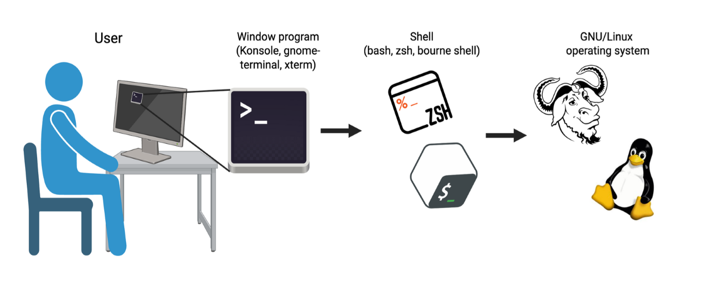
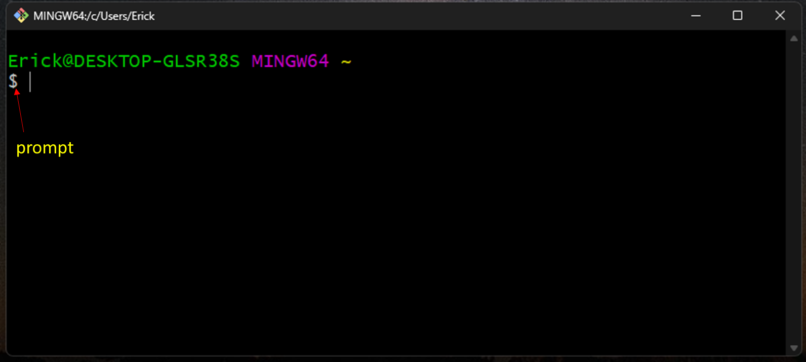
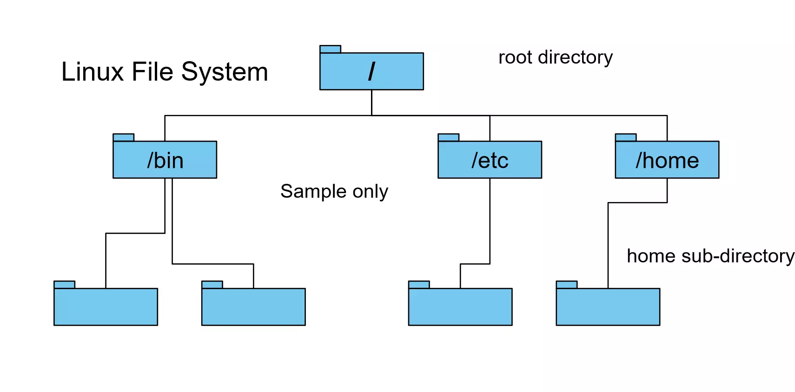
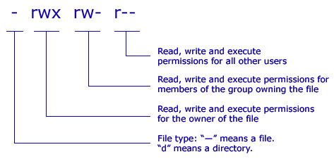
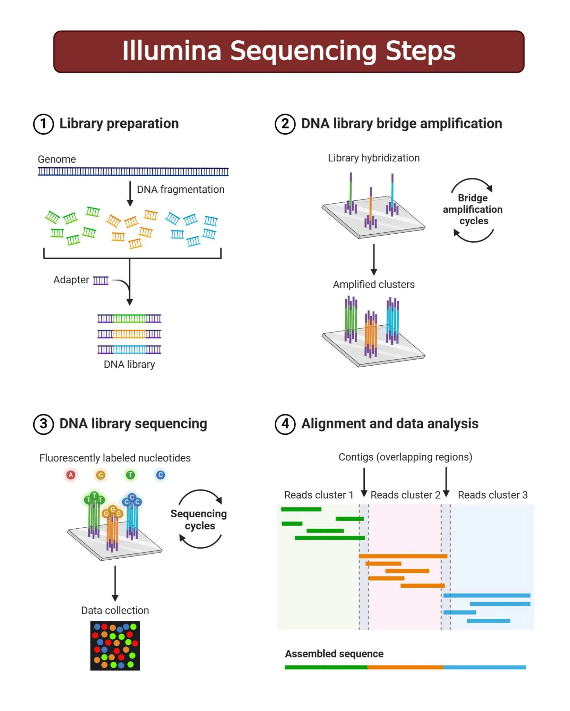
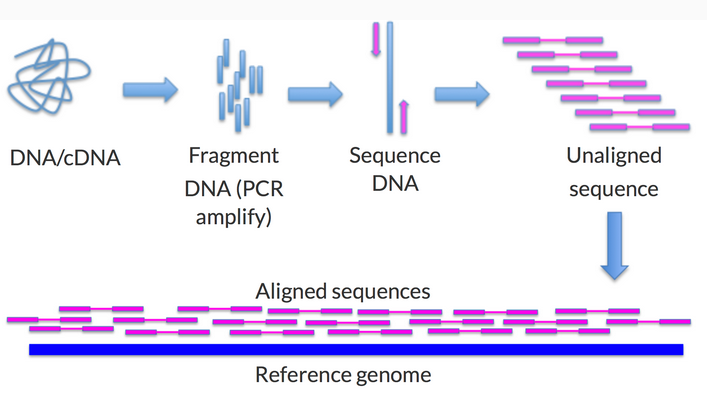
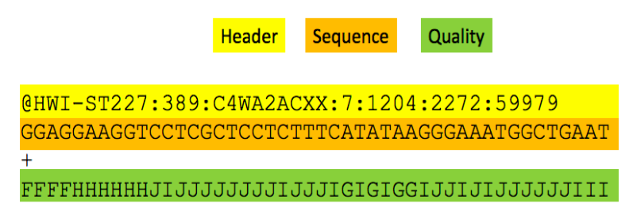
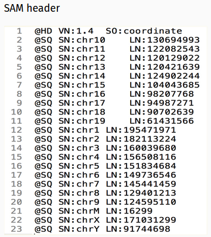
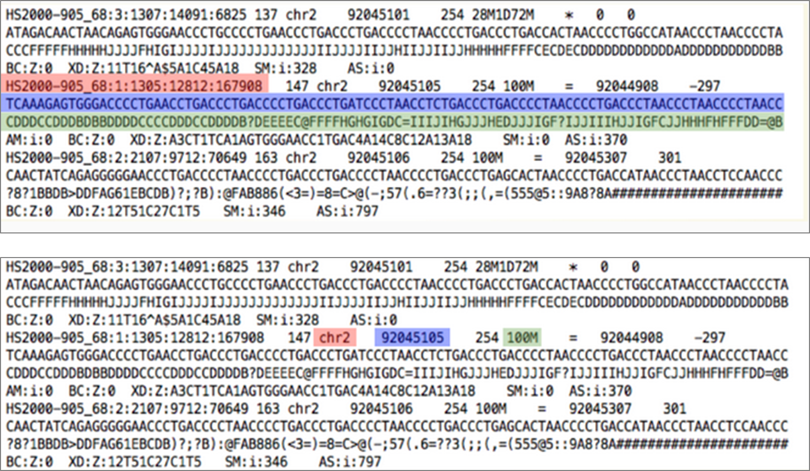
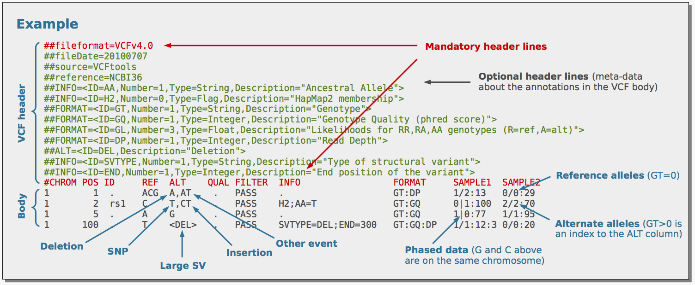

---
status---
title: "Introduccion a Linux para Genomica"
format: html
editor: visual
---

## Introducción a bash

#### Unix, Shell, Terminal - Se relacionan pero no son lo mismo.



En Windows la forma común en la que interactuamos con la computadora suele ser a través de la interface gráfica de usuario (GUI). Sin embargo esta forma no es eficiente cuando queremos realizar tareas repetitivas o a gran escala.

En Linux (Unix) o sistemas operativos similares a Unix podemos ejecutar estas tareas de manera más eficiente a través de la linea de comando.

Estos comandos son escritos en la terminal, que es una interface entre el usuario y la computadora.

Las comandos que escribimos en la terminal son interpretados por el programa Shell. Shell procesa los comandos y regresa los resultados. Bash es el shell por defecto en linux.

Cuando abrimos una terminal donde bash se ejecuta, nos aparece el prompt *\$* , que indica que el shell espera por el comando. El cursor (barra parpadeante) indica el espacio donde se escribe el comando.

{fig-align="center" width="472"}

``` bash
## Una función básica que podmeos ejecutar es ls para enlistar los archivos presentes en el directorio que estamos
ls
```

#### Sistema de archivos

{fig-align="center" width="453"}

El sistema de archivo de linux es jerarquico con el folder *root (/)* arriba de todos los otros folders o directorios. Este folder contiene todo, incluido el folder home (home directory). El acceso a root es para hacer modificaciones en el sistema, incluido la instalación de programas que sean accesibles a todos los usuarios.

El acceso al *home directory* permite al usuario trabajar y hacer modificaciones de los folder y archivos que le pertenecen.

#### Navegando en los directorios

``` bash
## Para explorar el contenido de un directorio podemos usar funciones básicas
cd # Cambiar directorio
pwd ## Regresa la ruta del directorio donde nos encontramos (Print working directory)
ls
```

*Rutas relativas y absolutas:*

-   Las rutas relativas es respecto al directorio donde nos encontramos.

-   La ruta absoluta es la ruta completa empezando con /

``` bash
### Si proporcionamos una ruta relativa a una función intentará buscarla en el directorio que estamos
ls my_docs ## La función ls buscará el directorio my_docs

### Si proporcionamos una ruta absoluta la función buscará desde el root
ls /home/user/my_docs

readlink -f mi_archivo ## Regresa la ruta absoluta del archivo mi_archivo y también funciona para directorios
```

#### Crear y manipular archivos y directorios

``` bash
mkdir ## Para crear un nuevo folder
touch # crea un archivo vacío
nano ## para editar un archivo de texto
cat ## Para mostrar el contenido de un archivo de texto
less ## Para mostrar el contenido de un archivo de texto poco a poco
head ## Muestra primeras 10 lineas de un archivo
tail # Muestra últimas 10 lineas de un archivo

cp ## Para copiar un archivo
mv ## para mover un archivo
rm ## para eliminar un archivo

## Para copiar y eliminar un folder agregamos el flag -r para indicar que ejecute en el directorio y todo el contenido
```

#### Permisos



Permisos de lectura (r), escritura (w) y ejecución (x)

Para cambiar los permisos usamos el comando *chmod*

``` bash
## Cuando trabajamos con scripts queremos que sean ejecutables
chmod +x my_script.sh
```

-   La tecla TAB

    -   Permite autocompletar el comando que estamos escribiendo en la terminal

#### Direccionando resultados y usando pipes

Una función se ejecuta y muestra el resultado. Pero podemos redirigir el resultado a un archivo o usarlo en una segunda función

``` bash
wc -l *txt ## Esta función muestra el número de líneas de los archivos de texto

wc -l *txt > n_lineas.txt ## El resultado se guarda en un nuevo archivo de texto

sort -n animales.txt | head -n 5 | wc -c > n_caracteres.txt ## Guarda el numero de caracteres de primeras palabras en resultado final
```

#### For Loop

Los loops permiten ejecutar funciones de manera repetitiva para cada elemento que se proporciona al loop.

``` bash
## Se inicia con for 
## in precede a la lista de elementos en los cuales se ejecutara el comando
for elemento in lista_de_elementos
do 
  comando $elemento
done
```

Ejemplos generales de loops

``` bash
### Loop en archivos *txt en directorio de trabajo
for file in *txt
do 
  wc -l $file
done

### Loop en contenido dentro de archivo

for animal in $(cat animales.txt) ## This works for this example because is a small filee with one word per line
do 
  echo $animal
done

### Loop en lista de numeros
for i in {1..5}
do 
  echo "Numero: "$i
done
```

#### Trabajando con scripts

Para evitar escribir de manera repetitiva un comando podemos guardarlo en un archivo que puede ser ejecutado cuando sea necesario. La extensión del archivo es .sh y se ejecuta anteponiendo la palabra bash.

La expresión #!/bin/bash al inicio del archivo indica que se ejecuta con bash.

``` bash
## Se crea un archivo de texto con nano
nano mi_script.sh

#!/bin/bash

for animal in $(cat animales.txt)
do
  echo $animal
done

## CTRL+O para guardar

bash mi_script.sh
```

### Información genómica

La secuenciación de genoma involucra desde la extracción de ADN hasta la generación de reads. El proceso inicia con la fragmentación del ADN que serán enriquecidos/amplificados. Esto último constituye la librería que pasará al secuenciador.

{fig-align="center" width="354"}

{fig-align="center" width="439"}

El genoma de referencia permite evaluar a los genes y características genómicas en un contexto genómico linear. Genes cercanos entre sí o si se encuentran en alguna región telomérica.

Esta conformado de cromosomas o contigs, que vienen a ser secuencias de ADN codificadas en A,C,G,T,N. Tipicamente en formato FASTA.

#### Archivo FastQ

{fig-align="center" width="454"}

-   Header

    -   sequencer unique ID

    -   run ID

    -   flowcell ID

    -   flowcell lane

    -   tile number within the flowcell lane

    -   x- and y- coordinates in within the tile.

-   Calidad (Q)

    -   Codificada en [ASCII](https://help.basespace.illumina.com/files-used-by-basespace/quality-scores).

    -   Q = -10log(p)

        -   p: probabilidad de que la base llamada sea incorrecta

#### Formato SAM (Sequence Alignment Map)

Formato estandar para guardar información de alinamiento

{width="281"}

-   \@HD: Incluye la versión del formato usado, y como está ordenado, por coordenadas

-   \@SQ: Información de los contigs/cromosomas y su longitud

**Reads alineados**

{width="413"}

Superior: Nombre de Read, Sequencia de read, Calidad

Inferior: Cromosome al cual el read está alineado, posición en el cromosoma donde el read está alineado, Información de alineamiento en formato CIGAR (100M: 100 bases hacen match continuo, 28M1D72M: 28 bases hacen match continuo, 1 deleción respecto a la referencia, seguido de 72 bases que hacen match).

#### Archivo de variantes ([VCF](https://samtools.github.io/hts-specs/VCFv4.2.pdf))

Archivo de texto que contiene información de metadata sobre el procesamiento de la data genómica, incluido el llamado de variantes y filtros.

Incluye la información de posición en el genoma donde identifica variantes genéticas y la información de genotipo para cada muestra incluida.



### Información de los datos genómicos

En la carpeta data se encuentra la información asociada a un archivo vcf con 10 mil variantes genéticas del cromosoma 21. El archivo original fue descargado del repositorio del proyecto 1000 genomas, de este se tomaron 10K variantes genéticas aleatoriamente. El VCF puede descargarse de este [enlace](https://www.dropbox.com/scl/fi/ojdvaajbx4lat9lz1dnjq/03192026_chr21_10KSNPs_sorted.vcf.gz?rlkey=6ny1sf1vrbg1gcpkug2khvg8k&st=jmdvg31f&dl=0).

``` bash
## Este es el enlace al repositorio que contiene el archivo VCF.
## Es un archivo de casi 20G, no se va a descargar nuevamente.

wget https://ftp.1000genomes.ebi.ac.uk/vol1/ftp/data_collections/1000G_2504_high_coverage/working/20190425_NYGC_GATK/vcf.gz

wget https://ftp.1000genomes.ebi.ac.uk/vol1/ftp/data_collections/1000G_2504_high_coverage/working/20190425_NYGC_GATK/vcf.gz
```

### Explorando el archivo VCF

-   Header

``` bash
 bcftools view -h VCF_file.vcf.gz | less
```

-   Datos de genotipo

``` bash
bcftools view -H VCF_file.vcf.gz | less 
```

El archivo contiene SNPs e indels, nosotros estamos interesados en los SNPs.

Hay diferentes programas que pueden usarse para filtrar archivos VCF, VCFtools es uno bastante útil para estos fines y sencillo de usar.

``` bash
## Filtrado de VCF para conservar solo SNPs
vcftools --vcf input_file.vcf --remove-indels --recode --recode-INFO-all --out SNPs_only
```

Además de conservar solo SNPs, adicionalmente podemos filtrar el archivo VCF en base a otros criterios que pueden ser indicadores de la calidad de la data.

En esta etapa se han llevado a cabo otros pasos de filtrado de calidad de los reads y de los archivos de alineamiento. Dependiendo del tipo de información que uno genera y de la fuente también se pueden considerar otros parámetros, especialmente cuando se trabaja con genomas colectado de poblaciones.

``` bash
## Filtrado de variantes

VCF=/path/to/vcf
mindp=5
maxmiss=0.9
minmaf=0.05

OUT=

vcftools --gzvcf $VCF \
    --min-alleles 2 --max-alleles 2 \
    --min-meanDP $mindp --minDP $mindp \
    --max-missing $maxmiss --maf $minmaf \
    --out $OUT \
    --recode --recode-INFO-all \
    --stdout | bgzip -c > $OUT

    tabix $OUT
```

### PCA

Primero filtraremos la data para reducir el numero de SNPs para filtrar los que están en LD

La data filtrada se puede procesar con plink2 para obtener los componentes principales

``` bash
## Modificar el script PCA.sh
```

Esto lo podemos plotear en R